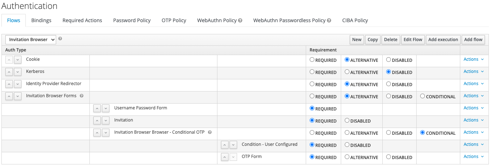

# Organizations for Keycloak

*Single realm, multi-tenancy for SaaS apps*

This project intends to provide a range of Keycloak extensions focused on solving several of the common use cases of multi-tenant SaaS applications that Keycloak does not solve out of the box. 

The extensions herein are used in the [Phase Two](https://phasetwo.io) cloud offering, and are released here as part of its commitment to making its [core extensions](https://phasetwo.io/docs/introduction/open-source) open source. Please consult the [license](COPYING) for information regarding use.

## Contents

- [Overview](#overview)
- [Installation](#installation)
- [Extensions](#extensions)
  - [Data](#data)
    - [Models](#models)
	- [Entities](#entities)
  - [Resources](#resources)
  - [Mappers](#mappers)
  - [Authentication](#authentication)

## Overview

If you search for "multi-tenant Keycloak", you'll find several opinionated approaches, each promising, and each with their own tradeoffs. This project represents one such approach. It was built initially for a multi-tenant, public cloud, SaaS application. It has now been, in the form of the [Phase Two](https://phasetwo.io) cloud offering, adopted by several other companies for the same purpose.

Other approaches that we tried and decided against were:
- One Realm for each tenant
- Using existing Keycloak Groups to model Organizations, Roles and Memberships

But each of these approaches had tradeoffs of scale or frailty we found undesirable or unacceptable to meet our requirements. Instead, we opted to make Organizations, and their Invitations, Roles and Memberships first-class entities in Keycloak. 

### Definitions

- **Organizations** are "tenants" or "customers" as commonly used. A Realm can have multiple Organizations.
- **Memberships** are the relationship of Users to Organizations. Users may be members of multiple Organizations.
- **Roles** are mechanisms of role-based security specific to an Organization, much like Keycloak Realm Roles and Client Roles. In addition to a set of standard roles related to Organization data visibilty and management, administrators can create Roles unique to an organization. Users who are Members of Organizations can be granted that Organization's Roles.
- **Invitations** allow Users and non-Users to be invited to join an Organization. Invitations can be created by administrators or Organization members with permission.

## Installation

The maven build uses the shade plugin to package a fat-jar with all dependencies. Put the jar in your `provider` (for Quarkus-based distribution) or in `standalone/deployments` (for Wildfly, legacy distribution) directory and restart Keycloak. It is unknown if these extensions will work with hot reloading using the legacy distribution.

During the first run, some initial migrations steps will occur:
- Database migrations will be run to add the tables for use by the JPA entities. These have been tested with H2 and Postgres. Other database types may fail.
- Initial `realm-management` client roles (`view-organizations` and `manage-organizations`) will be be added to each realm.

### Compatibility

Although it has been developed and working since Keycloak 9.0.0, the extensions are currently known to work with Keycloak > 17.0.0. Other versions may work also. Please file an issue if you have successfully installed it with prior versions.

## Extensions

### Data

We've adopted a similar model that Keycloak uses for making the Organization data available to the application. There is a custom SPI that makes the [OrganizationProvider](src/main/java/io/phasetwo/service/model/OrganizationProvider.java) available. The methods provided are:
```java
  OrganizationModel createOrganization(
      RealmModel realm, String name, String domain, UserModel createdBy);

  OrganizationModel getOrganizationById(RealmModel realm, String id);

  Stream<OrganizationModel> getOrganizationsStream(
      RealmModel realm, Integer firstResult, Integer maxResults);

  Stream<OrganizationModel> getOrganizationsStream(RealmModel realm);

  Stream<OrganizationModel> searchForOrganizationByNameStream(
      RealmModel realm, String search, Integer firstResult, Integer maxResults);

  Stream<OrganizationModel> getUserOrganizationsStream(RealmModel realm, UserModel user);

  boolean removeOrganization(RealmModel realm, String id);

  void removeOrganizations(RealmModel realm);

  Stream<InvitationModel> getUserInvitationsStream(RealmModel realm, UserModel user);
```

#### Models

The OrganizationProvider returns model delegates that wrap the underlying entities and provide conveninces for working with the data. They are available in the `io.phasetwo.service.model` package.
- [OrganizationModel](src/main/java/io/phasetwo/service/model/OrganizationModel.java)
- [OrganizationRoleModel](src/main/java/io/phasetwo/service/model/OrganizationRoleModel.java)
- [InvitationModel](src/main/java/io/phasetwo/service/model/InvitationModel.java)

#### Entities

There are JPA entities that represent the underlying tables that are available in the `io.phasetwo.service.model.jpa.entity` package. The providers and models are implemented using these entities in the `io.phasetwo.service.model.jpa` package.
- [OrganizationEntity](src/main/java/io/phasetwo/service/model/jpa/entity/OrganizationEntity.java)
- [OrganizationAttributeEntity](src/main/java/io/phasetwo/service/model/jpa/entity/OrganizationAttributeEntity.java)
- [OrganizationMemberEntity](src/main/java/io/phasetwo/service/model/jpa/entity/OrganizationMemberEntity.java)
- [OrganizationRoleEntity](src/main/java/io/phasetwo/service/model/jpa/entity/OrganizationRoleEntity.java)
- [UserOrganizationRoleMappingEntity](src/main/java/io/phasetwo/service/model/jpa/entity/UserOrganizationRoleMapping.java)
- [InvitationEntity](src/main/java/io/phasetwo/service/model/jpa/entity/InvitationEntity.java)

### Resources

A group of custom REST resources are made available for administrator and customer use and UI. Current documentation on the available resource methods is in this [openapi.yaml](https://github.com/p2-inc/phasetwo-docs/blob/master/openapi.yaml) specification file, and you can find browsable documentation on the [Phase Two API](https://phasetwo.io/api/) site.
- Organizations - CRUD Organizations
- Memberships - CRUD and check User-Organization membership
- Roles - CRUD Organization Roles and grant/revoke Roles to Users
- Identity Providers - A subset of the Keycloak IdP APIs that allows Organization administrators to manage their own IdP

### Mappers

There is currently a single OIDC mapper that adds Organization membership and roles to the token. The format of the addition to the token is
```
   organizations: [
     foo: [ "admin", "viewer" ],
     bar: []
   ]
```

### Authentication

#### Invitations

An custom Authenticator and Required Action must be installed and configured correctly in the browser authentication flow in order to properly process invitations. Assuming you are using the standard Keycloak browser flow, you must add the "Invitation" authenticator as a "REQUIRED" execution following the "Username Password Form" as a child of the "FORMS" group. This authenticator checks to see if the authenticated user has outstanding Invitations to Organizations, and then adds the Required Action that they must complete to accept or reject their Invitations following a successful authentication.



#### IdP Discovery

Organizations may optionally be given permission to manage their own IdP. The custom resources that allow this write a configuration in the IdP entities that is compatible with a 3rd party extension that allows for IdP discovery based on email domain configured for the Organization. It works by writing the `home.idp.discovery.domains` value into the `config` map for the IdP. Information on installing and further configuration is available at [sventorben/keycloak-home-idp-discovery](https://github.com/sventorben/keycloak-home-idp-discovery).

tbd screenshot of installing in flow

-----

All documentation, source code and other files in this repository are Copyright 2022 Phase Two, Inc.

